# A new mod approaches!
This is a new method of installing an FDS Stick into a Sharp Twin Famicom
Rather than having to cut the plastic card cover or have an ugly wire hanging around, this mod gives you a nice professional looking install!

#### How to Install

1. Start by printing the modded cover and snap cover

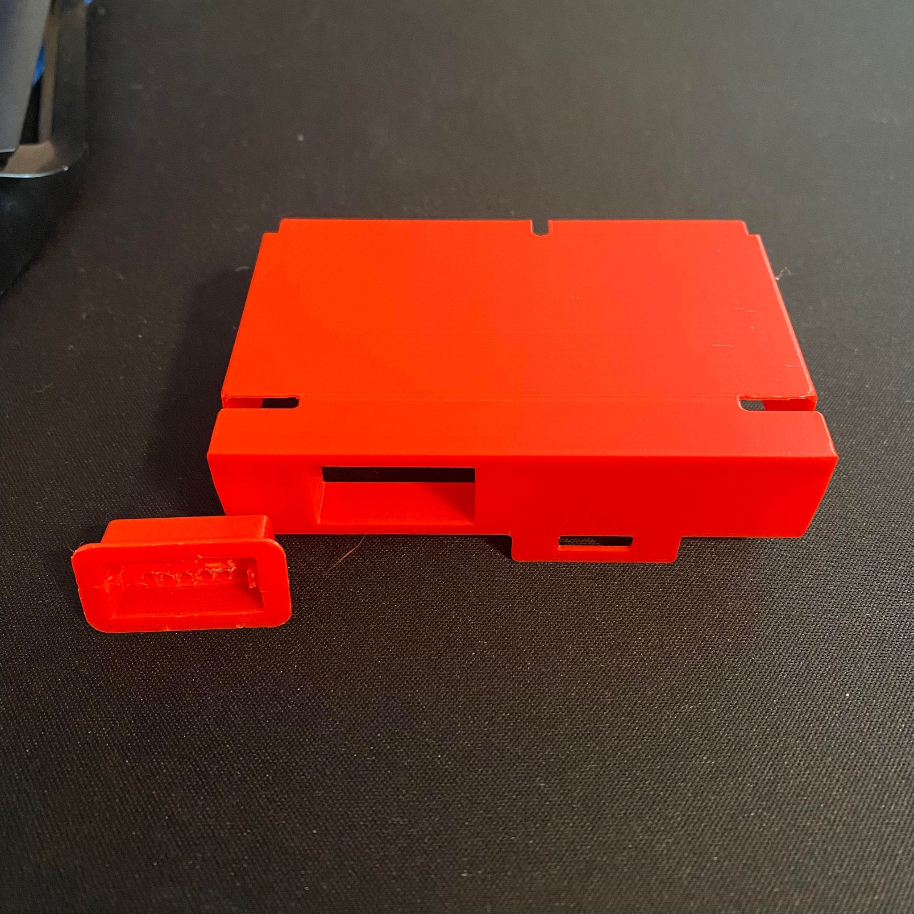
     
2. While that prints (roughly 3 hours) gather materials from the BOM

3. Refer to screenshots for proper installation of the JST connector and header pins

 

4. Use sandpaper, a dremel, or a hot knife to remove the bump from the connector. Note if using a hot knife - pay attention! That's how mine came out so marred.
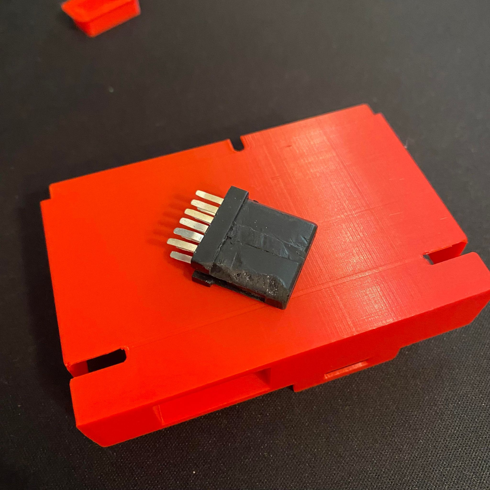

5. Remove locking back for SNES AV and insert the SNES connector into the snap cover (orientation is not important)
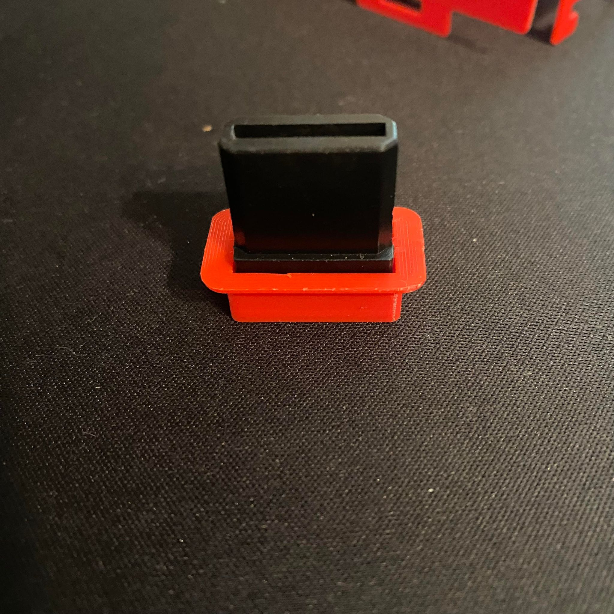
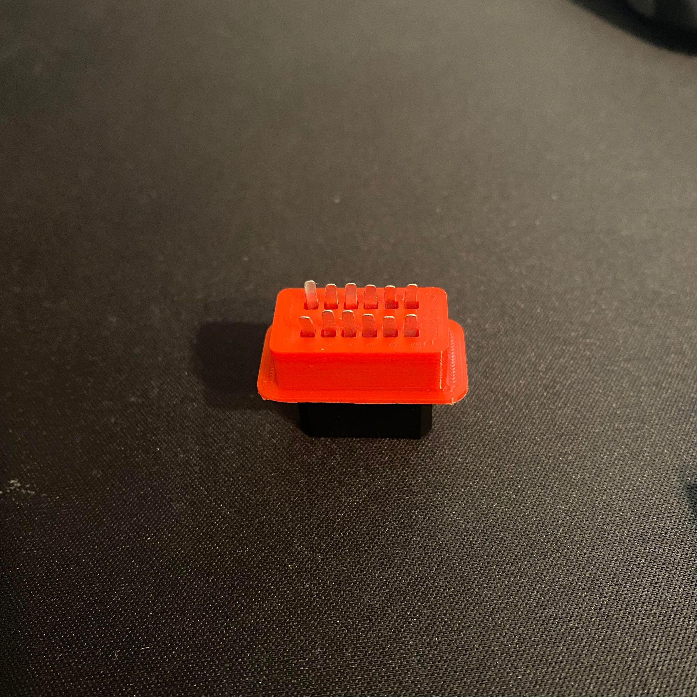

6. Assemble the XHP-12 connector cable as shown in pictures - *do not insert a jumper into pin 12 of the white connector!*
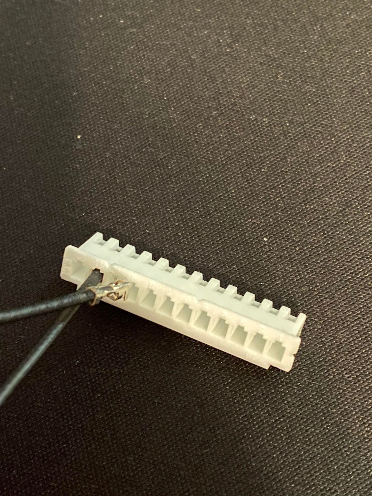
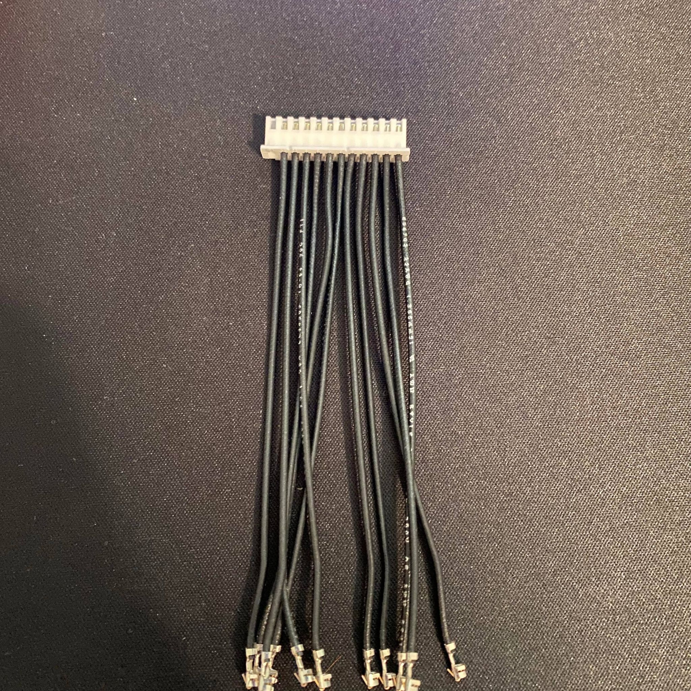

7. Remove the jumper ends and use wire strippers to remove the sheath
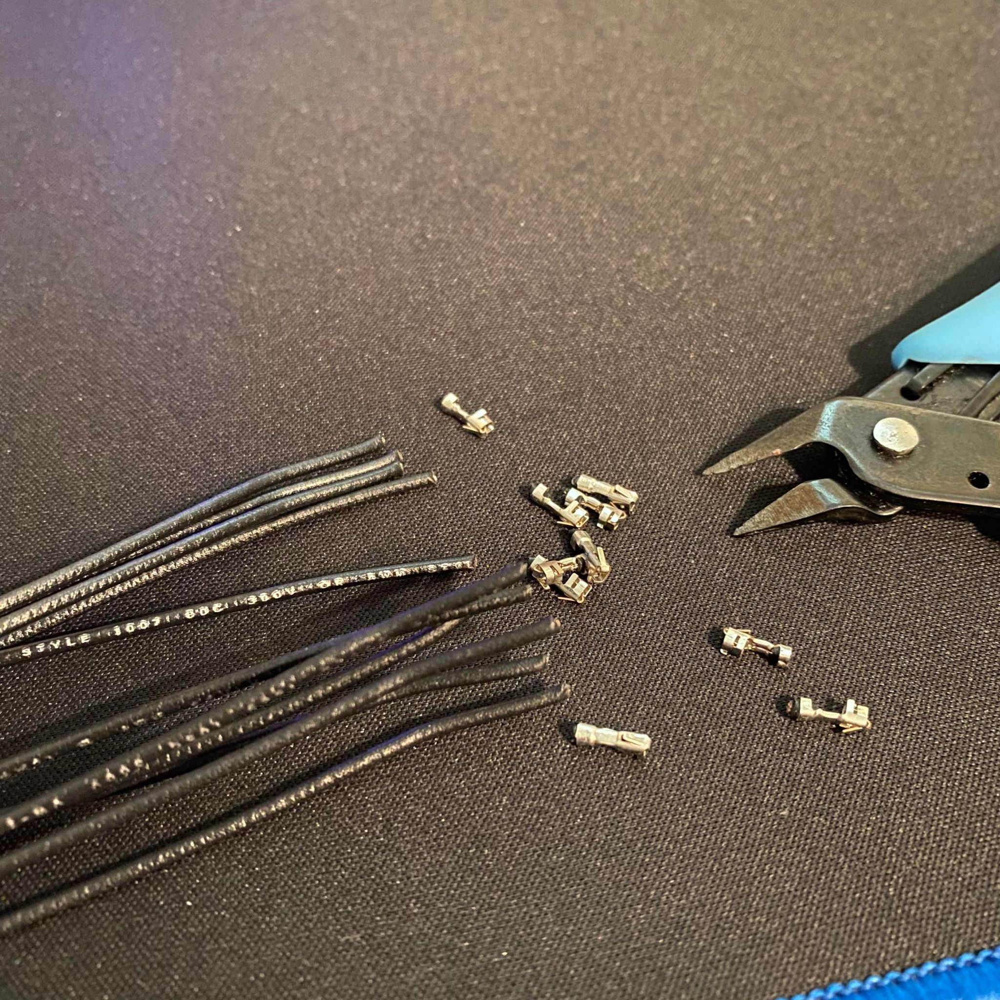

8. Run the wires throught the opening in the modded Twin Famicom cover

9. Install the wires according to this diagram from 3DS Captures site:

**Note**: It is *crucial* that you double check your work as one wrong connection can make your FDS Stick short circuit

**Note**: See how I put my SNES connector upside down? Not only does it hide the ugly parts, it is also my guide so that I know which pins are being soldered to
The goal is to have the FDS Stick facing up so you can easily press the button for flipping disks
		

10. Insert the ram adapter into the top row of holes in the Twin Famicom - Please see photos 10 & 11
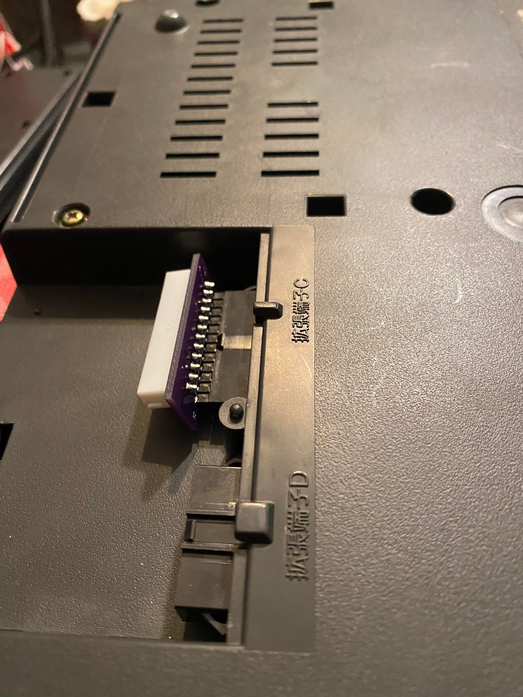
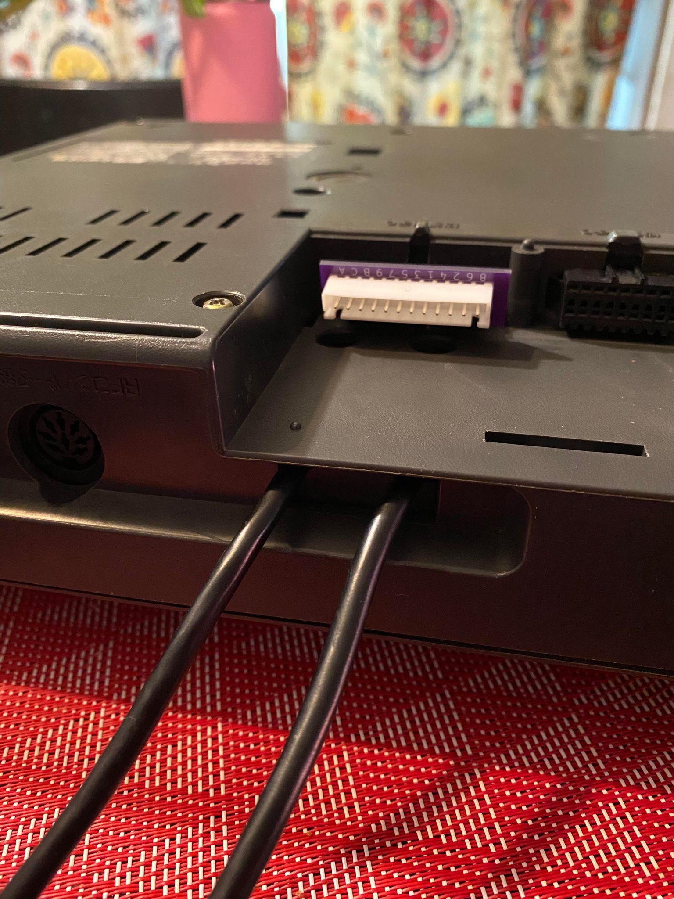
   
11. Carefully snap in the snap cover if you haven't already. If the snap cover isn't tight enough, a small dab of superglue will do the trick.
**Remember** orientation is important! You dont want to fry your FDS Stick
    
12. Connect the white connector
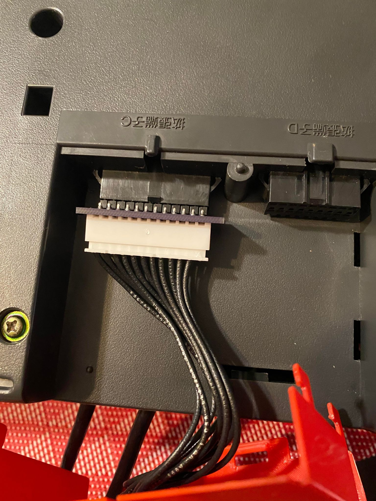
    
13. Carefully install the modded Famicom cover
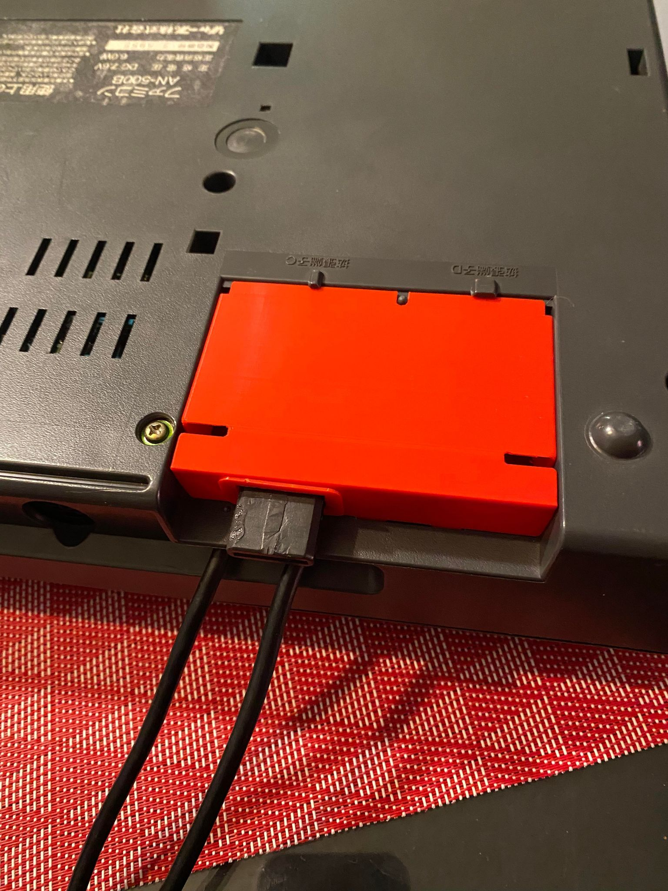
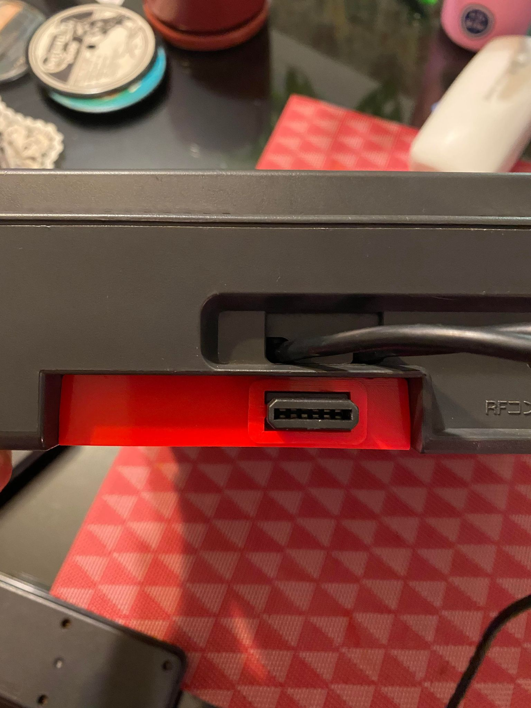

14. Plug in your FDS Stick and enjoy!
